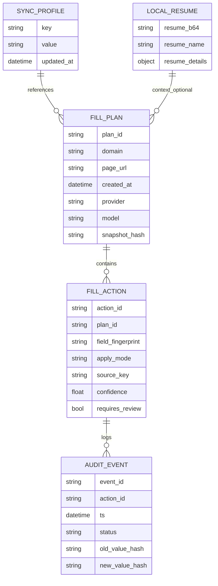

# PLAN_v2.md — AI‑Enhanced Autofill (FillPlan) for exempliphai

**Date:** 2026-03-09  
**Repo:** `yadasa/exempliphai` (MV3 Chrome extension)  
**Context inputs used:**
- Deep Research Report PDF (converted to `_research/deep_research_report.txt`)
- `DATA_FIELDS.md`
- Recent commits: `c19dc26`, `48c6c08` (Greenhouse/Lever autofill improvements in `autofill.js` + `utils.js`)

> Goal: Add a generalized AI-assisted layer that (1) extracts robust semantic field descriptors, (2) fills deterministically where possible, (3) calls AI **only** for unresolved/ambiguous fields, returning a structured **FillPlan**, and (4) executes that plan with strict policy gating + consent.

---

## 0) Gemini-Only Mode — 2026-03-22

This repo runs in **Gemini-only mode**: all AI features call the Gemini REST API. There is no non-Gemini provider dependency.

**Settings (Popup → Settings):**
- `API Key` (Gemini)
- `AI Model`:
  - `gemini-1.5-flash` (faster/cheaper)
  - `gemini-1.5-pro` (more capable)
- `Auto-Tailor Resumes` toggle (default OFF)

### Resume Tailoring (Gemini)

**What’s implemented (high level):**
- **Popup UI:** A **“Tailor Resume”** button appears under the **Resume** file field.
- **Job context extraction:** Popup calls background IPC → content script heuristics to extract:
  - IPC path: popup `postMessage('EXTRACT_JOB_CONTEXT')` → background → tab `sendMessage('SMARTAPPLY_EXTRACT_JOB_CONTEXT')`
  - job title (H1 / meta / <title>)
  - job description (#job_description / .job__description / .job-description / main, etc)
- **Core tailoring:** Sends *structured* `Resume_details` + job title + JD to Gemini and stores:
  - `chrome.storage.local.tailored_resume_details`
  - `chrome.storage.local.tailored_resume_text`
- **Preview + download:** Preview in modal, download as **.txt** or **PDF**.
- **Autofill integration:** If auto-tailor is enabled, content script will tailor once per job (best-effort cache) and prefer `tailored_resume_details`.
- **Audit/cost logging:** AI calls append to `chrome.storage.local.audit_log`:
  - `{ model, input_tokens, output_tokens, cost_estimate }` (plus timestamp/event)

### Job Search (Gemini)

This repo includes a **Job Search** tab in the popup that generates job recommendations from your saved resume (prefers `tailored_resume_details` when available).

**What’s implemented (high level):**
- **Popup UI:** New **Job Search** tab with a **“Search Jobs Matching My Resume”** button.
- **Core logic:** Calls Gemini and requests a strict JSON array:
  - `[{ title, company_types, salary_range, locations, why_match, search_link }]`
  - `search_link` is a smart LinkedIn/Google/Indeed query URL.
- **Display:** Recommendation cards with:
  - **Open Search** → `chrome.tabs.create(search_link)`
  - **Tailor & Apply** → tailors resume to the current page’s job description (when available), saves `tailored_resume_details`, then triggers **autofill now** on the active tab.
- **Audit/cost logging:** Job-search calls append to `chrome.storage.local.audit_log` with `{ model, input_tokens, output_tokens, cost_estimate }` plus timestamp/event.

## 1) Inventory Alignment (Report → Current Repo)

The report’s “inventory table” matches the current structure closely; below is the alignment plus gaps relevant to AI FillPlan.

### 1.1 Inventory map

| Report path | Present now? | Current path | Notes |
|---|---:|---|---|
| `src/public/manifest.json` | ✅ | `src/public/manifest.json` (+ `dist/manifest.json`) | **Broad match** includes `https://*.com/*` → gating is mandatory (both deterministic + AI). Manifest uses `type: "module"` but current content scripts do not use ESM exports/imports (see §1.3). |
| `src/public/background.js` | ✅ | `src/public/background.js` | Context-menu + command send `{action:'TRIGGER_AI_REPLY'}` to content scripts; stores last3Questions in local. |
| `src/public/contentScripts/utils.js` | ✅ | `src/public/contentScripts/utils.js` | Field maps (`fields`), storage helpers, `setNativeValue`. **Missing:** contenteditable/rich-editor set, date/time normalization, semantic label extraction utilities beyond current `getLabelText` (in `autofill.js`). |
| `src/public/contentScripts/autofill.js` | ✅ | `src/public/contentScripts/autofill.js` | Current deterministic + heuristic autofill engine; includes AI answer generation (Gemini) for last right-clicked element (embedded under `param === "Resume"` path). **Missing:** a dedicated snapshot extractor + FillPlan orchestrator. |
| `src/public/contentScripts/workday.js` | ✅ | `src/public/contentScripts/workday.js` | Workday-specific staged autofill. |
| `src/index.html`, `src/vue_src/*` | ✅ | `src/index.html`, `src/vue_src/*` | Popup SPA: profile editor, resume upload → Gemini resume parsing, settings (API Key), job tracker, privacy toggle, etc. |
| Examples fixtures | ✅ | `examples/greenhouse/*`, `examples/lever/*` | Used for regression; should become Playwright fixtures for FillPlan tests.

### 1.2 “Missing handler” checklist (what’s not covered consistently today)

**From the report + repo inspection:**
- **Contenteditable / rich editors** (Quill/Draft/Slate/Tiptap): no generalized write path (current `setNativeValue` is input/textarea/select/checkbox/radio only).
- **Date/time pickers**:
  - native `input[type=date|time|datetime-local]` not normalized/formatted;
  - split month/day/year patterns need a utility (Workday has its own flow).
- **Custom widgets library**: there is ad-hoc handling (ARIA combobox listbox + Greenhouse react-select), but not unified under a “widget adapter” abstraction.
- **Field semantics extraction**: label inference exists (`getLabelText` in `autofill.js`), but a reusable “accessible name + bounded neighbors + section context” extractor does not.

### 1.3 Important technical debt to resolve before adding modules

Manifest declares content scripts with `"type": "module"`.
- **Current reality:** `autofill.js` has ESM imports commented out, and `utils.js` does not export symbols.
- **Plan:** pick one:
  1) **Make scripts true ESM** (recommended): export from `utils.js`, import in `autofill.js`, and add new modules (`formSnapshot.js`, `aiFillPlan.js`, `fillExecutor.js`, adapters).  
  2) Or remove `type: "module"` and keep classic-script globals (faster short-term, but blocks clean modularization).

**This plan assumes option (1)** to keep the FillPlan engine maintainable.

---

## 2) AI FillPlan Core

### 2.1 FillPlan goals

A FillPlan is a **structured, validated** set of actions:
- references a stable **fieldFingerprint** (not a raw selector)
- chooses **source_key** (existing profile storage key) or **derived** value
- optionally specifies a **transform** from a restricted library
- carries **confidence**, **reason**, and optional **alternatives**
- is filtered by **policy** (consent + sensitive categories)

### 2.2 FillPlan JSON schema (v0)

> Keep schema minimal for v0; expand once tests stabilize.

```jsonc
{
  "version": "0.1",
  "plan_id": "uuid-or-random",
  "created_at": "2026-03-09T14:19:00.000Z",
  "domain": "boards.greenhouse.io",
  "page_url": "https://...",
  "provider": { "name": "gemini" , "model": "gemini-3-flash-preview" },

  // Snapshot summary so the plan can be validated without re-sending DOM
  "snapshot_hash": "sha256(base64)",

  "actions": [
    {
      "action_id": "uuid-or-random",
      "field_fingerprint": "fp:...",

      // What we think the control is (for executor routing)
      "control": {
        "kind": "input|textarea|select|radio-group|checkbox-group|combobox|contenteditable|file|date|time|datetime-local|unknown",
        "tag": "input",
        "type": "text",
        "role": "textbox",
        "name": "first_name",
        "id": "first_name",
        "autocomplete": "given-name"
      },

      // Human-meaningful descriptor extracted from DOM semantics
      "descriptor": {
        "label": "First Name",
        "description": "",
        "section": "Personal Information",
        "required": true,
        "visible": true,
        "options": [
          // Only for selects/combobox/radio groups (strings only)
        ]
      },

      // Where the value should come from
      "value": {
        "source": "profile|resume_details|derived|literal|skip",
        "source_key": "First Name",          // required when source==profile
        "literal": null,                      // used when source==literal
        "derived": {                          // used when source==derived
          "kind": "Current Date|FullNamePart|CityStateCountry|...",
          "args": { }
        }
      },

      // Optional transform pipeline from a restricted enum
      "transform": [
        { "op": "trim" },
        { "op": "normalize_phone", "format": "E164" }
      ],

      // How to apply (executor may override with widget adapters)
      "apply": {
        "mode": "set_value|select_best_option|click_best_label|upload_resume|upload_linkedin_pdf",
        "allow_overwrite": false
      },

      "confidence": 0.86,
      "reason": "label matched: 'given name' → profile.First Name",

      "alternatives": [
        {
          "value": { "source": "profile", "source_key": "Full Name" },
          "transform": [{ "op": "full_name_part", "part": "first" }],
          "confidence": 0.62,
          "reason": "fallback: derive from Full Name"
        }
      ],

      // Policy gating
      "policy": {
        "sensitive_category": "eeo|health|biometric|none",
        "requires_review": false,
        "requires_explicit_consent": false
      }
    }
  ]
}
```

**Transform ops (restricted library; executor implements):**
- `trim`, `collapse_whitespace`, `ensure_https`
- `full_name_part: {part:first|middle|last}`
- `normalize_phone: {format:E164|national}`
- `month_name_to_number`, `iso_date_to_control_format` (for date/time)
- `city_state_country` (existing behavior in `formatCityStateCountry`)

### 2.3 Deterministic → AI boundary

**Deterministic (Tier 0):**
- Use existing `fields[platform]` mapping + improved semantic extraction to resolve obvious fields.
- Use existing `setBestSelectOption`, radio/checkbox group clickers.
- Use adapter-based selection for react-select/ARIA combobox.

**AI mapping (Tier 1):**
- Only for **unresolved/ambiguous** fields after Tier 0.
- AI returns **FillPlan actions** referencing existing `source_key` values (not raw PII).

**AI generation (Tier 2):**
- Only for long-form textareas/contenteditable fields OR explicit user action (context menu).
- Output is literal text (still stored only in DOM unless user opts to save).

---

## 3) Integration Phased Plan

### Phase 1 — Semantic field extraction (utils.js + new modules)

**Deliverable:** A reusable snapshot extractor that captures safe, bounded semantics.

**Add module:** `src/public/contentScripts/formSnapshot.js`
- `findControls(root)` includes:
  - `input, textarea, select`
  - `[contenteditable="true"], [role="textbox"], [role="combobox"]`
  - (optional) known rich editor roots: `.ql-editor`, `[data-slate-editor]`, `.ProseMirror`
- `computeBestLabel(el)` (priority order):
  1. `aria-label`
  2. `aria-labelledby` (resolve ids)
  3. `label[for=id]`
  4. wrapping `<label>`
  5. `fieldset legend`
  6. bounded nearby text (closest question container; max chars)
- `extractSectionContext(el)`:
  - nearest headings (`h1..h4`) + legend; bounded and trimmed
- `extractOptions(el)`:
  - native `<select>` options
  - ARIA listbox options where discoverable
  - for react-select: placeholder token → listbox id heuristic (report’s suggestion)
- `stableFingerprint(el)`:
  - Prefer: `id` else `name` else `autocomplete` + `labelHash` + `indexWithinForm`
  - Must be stable across re-renders; include a `salt`/version.

**Enhance utils:**
- Add `setContentEditableValue(el, text)` (dispatch `beforeinput`/`input` when possible)
- Add date/time helpers: `parseToISODate`, `formatForNativeDateInput`, `splitDateParts`

**Why now:** All later AI work depends on consistent field descriptors.

### Phase 2 — Hybrid flow in autofill.js (deterministic → AI gaps → execute plan) ✅

**Deliverables:**
- deterministic fill remains the default
- FillPlan orchestration is added as an *additive* layer

**New modules:**
- `aiFillPlan.js` — builds the AI request and validates response
- `fillExecutor.js` — applies actions with undo stack + confidence thresholds
- `policy.js` — gating rules (sensitive categories, consent checkboxes, etc.)
- `providers/gemini.js` (+ optional `providers/openai.js`)
- `adapters/*` — widget adapters (AriaCombobox, ReactSelect, MUISelect as future)

**Autofill flow (v0):**
1. Build snapshot from `findBestForm()` root.
2. Run deterministic matcher:
   - map fields using existing platform table + fuzzy label matching
   - generate actions for resolved controls
3. Identify unresolved fields and apply policy pre-filter (don’t send consent gates).
4. If AI mapping enabled + unresolved exists:
   - call provider with mapping prompt → receive FillPlan
   - validate schema + policy gate
5. Merge deterministic + AI plan; execute with executor.

**Execution policies:**
- Don’t overwrite user-touched fields except on explicit button press (`force`).
- Never auto-check “I agree/consent” checkboxes.
- Sensitive EEO/disability/veteran/visa fields: require either explicit domain consent or review overlay.

### Phase 3 — Popup UI (consent, AI key mgmt, canonical profile schema)

**Consent UI (Settings tab):**
- Toggle: **Enable AI-assisted autofill (mapping)** (default OFF)
- Toggle: **Allow AI text generation for long-form questions** (default OFF)
- Per-domain permission list:
  - `allowAiMapping[domain]=true/false`
  - `allowSendResumeDetails[domain]=true/false`

**Key management:**
- Support provider selection (Gemini / OpenAI)
- Store keys in `chrome.storage.local` (not sync) by default (per report guidance).
- Keep export behavior: never export keys.

**Canonical profile schema (incremental migration):**
- Introduce `profileV2` (stable keys) while continuing to read/write legacy label-keys for compatibility.
- Add mapping table `LABEL_KEY ↔ CANONICAL_KEY`.
- Content scripts prefer canonical keys internally; fallback to legacy keys at read time.

---

## 4) Security / Privacy (non-negotiables)

### 4.1 Data minimization rules

**Tier 1 (mapping) AI requests should NOT include:**
- full `chrome.storage.sync` dump
- resume PDF base64
- raw page HTML

**Tier 1 requests MAY include:**
- the list of allowed profile keys (names only) + types
- unresolved field descriptors (label/role/type/autocomplete/required/options), bounded context only

**Tier 2 (generation) requests MAY include (only with explicit opt-in):**
- resume details JSON (skills/experience bullets)
- the single question prompt and limited site hints

### 4.2 Policy gates

Block or require review when:
- checkbox label contains `agree|consent|authorize|acknowledge|terms|privacy|gdpr|ccpa`
- field belongs to sensitive categories (EEO, disability, veteran) unless user enabled

### 4.3 Logging

- Store only plan metadata + hashed old/new values in local (optional), never raw answers by default.
- Maintain an in-memory undo stack for the last run; add a one-click “Undo Autofill”.

---

## 5) Prioritized Steps (5–10 concrete tasks)

> Estimates assume one engineer; parallelizable where noted.

1) **Decide module strategy + make content scripts real ESM** *(0.5–1 day, blocks most tasks)*
   - Export needed symbols from `utils.js` and `workday.js`
   - Re-enable imports in `autofill.js`
   - Ensure build/dist still works.

2) **Implement `formSnapshot.js` + unit tests for labeling/fingerprinting** *(4–7 days)*
   - Covers: `label[for]`, wrapping label, `aria-labelledby`, `fieldset legend`, headings
   - Add fixtures for tricky Greenhouse/Lever controls.

3) **Add missing control handlers** *(3–6 days)*
   - `contenteditable` set + events
   - native date/time formatting + split date parts
   - unify react-select + aria combobox into adapter abstraction

4) **Define FillPlan schema + validator** *(2–3 days)*
   - JSON schema validation (lightweight)
   - strict allowlist for `transform.op` and `apply.mode`

5) **Build AI Provider interface (Gemini first, OpenAI optional)** *(2–4 days)*
   - `mapFieldsToFillPlan()` (Tier 1)
   - `generateNarrativeAnswer()` (Tier 2)
   - timeouts + retry + failure modes

6) **Integrate hybrid flow into `autofill.js`** *(2–5 days)*
   - deterministic pass produces partial plan
   - AI only for unresolved
   - execute merged plan

7) **Consent + settings UI** *(2–4 days)*
   - global toggles + per-domain permissions
   - move keys to `storage.local`

8) **Playwright harness for fixtures** *(2–5 days; can start earlier)*
   - Run content scripts against:
     - `examples/greenhouse/FULL_HTML/*.html`
     - `examples/lever/*.html`
   - Assert filled values for basics + EEO + a sample custom question.

9) **Review overlay for low-confidence/sensitive fields** *(5–10 days; Phase 3b)*
   - Only after schema+executor stable.

---

## 6) Prompts / Templates (Gemini + OpenAI)

### 6.1 Tier 1 (mapping) — System prompt (shared)

```text
You are a form-field mapping engine for a browser extension.

You will receive:
- a list of form fields extracted from the DOM (labels, roles, types, options)
- a list of allowed profile keys (strings) that exist in chrome.storage
- policy constraints (what not to fill)

Task:
Return ONLY valid JSON matching the FillPlan schema described in the user message.

Rules:
- Do NOT invent new profile keys.
- Prefer mapping to an existing profile key. If none fits, set value.source="skip".
- Never propose checking consent/terms/acknowledgement checkboxes.
- If the field is sensitive (EEO/disability/veteran/visa), set policy.requires_review=true unless explicitly allowed.
- Do not include any prose outside JSON.
```

### 6.2 Tier 1 (mapping) — User prompt (Gemini/OpenAI)

```jsonc
{
  "task": "map_unresolved_fields_to_profile_keys",
  "domain": "${domain}",
  "allowed_profile_keys": [
    "First Name", "Middle Name", "Last Name", "Full Name", "Email", "Phone",
    "LinkedIn", "Github", "LeetCode", "Medium", "Personal Website", "Other URL",
    "Location (Street)", "Location (City)", "Location (State/Region)", "Location (Country)", "Postal/Zip Code",
    "Legally Authorized to Work", "Requires Sponsorship", "Willing to Relocate", "Date Available",
    "Pronouns", "Gender", "Race", "Hispanic/Latino", "Veteran Status", "Disability Status",
    "School", "Degree", "Discipline", "GPA", "Years of Experience", "Expected Salary", "Job Notice Period",
    "Current Employer", "Current Date"
  ],
  "policy": {
    "never_autofill_consent_checkboxes": true,
    "sensitive_requires_review": true
  },
  "unresolved_fields": [
    {
      "field_fingerprint": "fp:...",
      "control": {"kind":"combobox","tag":"input","type":"text","role":"combobox","name":"question_123","id":""},
      "descriptor": {
        "label": "Do you now or in the future require sponsorship to work in the United States?",
        "description": "",
        "section": "Application Questions",
        "required": true,
        "options": ["Yes", "No", "Prefer not to answer"]
      }
    }
  ],
  "response_requirements": {
    "output": "FillPlan",
    "max_actions": 64
  }
}
```

**Expected output:** A FillPlan with `actions[]` mapping each fingerprint to a `value.source_key` and optional transforms.

### 6.3 Tier 2 (generation) — System prompt

```text
You write concise, professional job-application answers in first person.
Return only the answer text.
Do not include placeholders like [Company] or [Your Name].
If the prompt asks for sensitive personal information, keep it minimal and consistent with provided profile data.
```

### 6.4 Tier 2 (generation) — User prompt template

```text
Question: ${question_text}

Constraints:
- Target length: ${max_words} words
- Tone: professional, direct
- If asked for motivation: align to skills + impact

Resume details (structured):
${resume_details_min}

Optional profile facts:
${profile_subset}
```

---

## 7) Mermaid Diagrams

### 7.1 Autofill orchestration (hybrid)

```mermaid
flowchart TD
  A[User clicks 🚀 Autofill Now
(or auto-trigger)] --> B[Form Snapshot Extractor]
  B --> C[Deterministic Matcher
(platform map + semantic label match)]
  C -->|Resolved| D[Executor: apply actions]
  C -->|Unresolved| E{AI mapping enabled
+ policy allows?}
  E -->|No| D
  E -->|Yes| F[Build minimal AI prompt
(fields + allowed keys)]
  F --> G[Provider call
(Gemini/OpenAI)]
  G --> H[FillPlan JSON]
  H --> I[Schema validate + Policy gate]
  I -->|approved| J[Merge with deterministic plan]
  J --> D
  D --> K[Undo stack + audit metadata]
  K --> L[Done]
```

### 7.2 Storage / entities (ER-style)



---

## 8) Notes on Existing Code (what to reuse vs replace)

- Reuse:
  - `setBestSelectOption`, radio/checkbox group clickers, current Greenhouse react-select heuristic (but wrap as adapter)
  - `_filledElements` logic to prevent repeated overwrites
  - ATS gating logic (`isLikelyApplicationPage`) but tighten for `https://*.com/*`

- Refactor:
  - Move AI answer generation out of the `param === "Resume"` branch into a dedicated module (so AI generation is available independent of file-upload handling).
  - Replace scattered label heuristics with shared `computeBestLabel` + snapshot.

---

## 9) Definition of Done (v0)

- Deterministic autofill behavior unchanged on Greenhouse + Lever fixtures.
- New snapshot extractor reliably identifies:
  - standard inputs
  - react-select comboboxes
  - at least one contenteditable editor root (fixture to be added)
  - native date input
- AI mapping (opt-in) fills at least 2 ambiguous custom questions on fixtures without wrong-field pollution.
- No consent checkbox is auto-checked.
- A per-domain AI permission gate exists in the popup.
